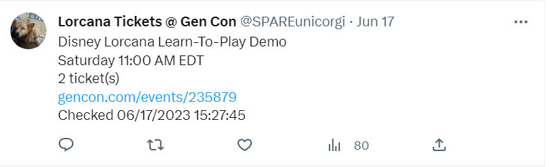

<a name="readme-top"></a>
<div align="center">

[![Contributors][contributors-shield]][contributors-url] [![LinkedIn][linkedin-shield]][linkedin-url]

</div>
<p></p>

> [!CAUTION]
> *Twitter's (X) API service has severely restricted the request limit in the free plan. Due to this change, the project no longer functions as intended.
> Please see [pricing here](https://developer.x.com/en).*

<p></p>
<h3 align="center">Lorcana Web Scraper</h3>

  <p align="center">
    Python script created to obtain ticket availability for Lorcana events at Gen Con and tweet when tickets are available.

</div>


<!-- TABLE OF CONTENTS -->
<details>
  <summary>Table of Contents</summary>
  <ol>
    <li>
      <a href="#about-the-project">About The Project</a>
      <ul>
        <li><a href="#built-with">Built With</a></li>
        <!-- <li><a href="#features">Features</a></li> -->
      </ul>
    </li>
    <!-- <li>
      <a href="#getting-started">Getting Started</a>
      <ul>
        <li><a href="#prerequisites">Prerequisites</a></li>
        <li><a href="#installation">Installation</a></li>
      </ul>
    </li> -->
    <!-- <li><a href="#usage">Usage</a></li>
    <li><a href="#roadmap">Roadmap</a></li>
    <li><a href="#contributing">Contributing</a></li>
    <li><a href="#license">License</a></li>
    <li><a href="#contact">Contact</a></li>
    <li><a href="#acknowledgments">Acknowledgments</a></li> -->
  </ol>
</details>


<!-- ABOUT THE PROJECT -->
## About The Project

This project was created due to the popularity of the up and coming Disney trading card game, Lorcana by Ravensburger. Lorcana is debuting at [Gen Con](https://www.gencon.com/) 2023, North America's largest and longest running tabletop convention. The goal was to provide a singular location with the ability to receive real-time notifications of event ticket availability for over 40 events dedicated to Lorcana. 

The screenshot below shows when an event has been tweeted that has tickets by providing the name of the event, the date and time, number of tickets available, the direct event link and a timestamp.


<div align="center">



</div>

<p align="right">(<a href="#readme-top">back to top</a>)</p>


### Built With
<div align="center">


</br>

</br>


</div>


<p align="right">(<a href="#readme-top">back to top</a>)</p>


<!-- GETTING STARTED 
## Getting Started

It is recommended that you use virtual environments for your Python development.  

### Prerequisites

The libraries needed to run this script are located in the requirements.txt file. 
* Install requirements.txt libraries
```sh
pip install -r requirements.txt
```
This is an example of how to list things you need to use the software and how to install them.
* [Java 17.0.3](https://www.oracle.com/java/technologies/javase/jdk17-archive-downloads.html)
* [JAVAFX.SDK.18.0.1](https://gluonhq.com/products/javafx/)
  ```sh
  --module-path ${PATH_TO_FX} --add-modules javafx.fxml,javafx.controls,javafx.graphics
  ```
* [mysql-connector-java-8.0.29](https://dev.mysql.com/downloads/connector/j/?os=26)
  ```sh
  
  ```

### Installation

1. Get a free API Key at [https://example.com](https://example.com)
2. Clone the repo
   ```sh
   git clone https://github.com/mriffey1/lorcana-scraper.git
   ```
3. Install NPM packages
   ```sh
   npm install
   ```
4. Enter your API in `config.js`
   ```js
   const API_KEY = 'ENTER YOUR API';
   ```

<p align="right">(<a href="#readme-top">back to top</a>)</p>
-->


<!-- USAGE EXAMPLES 
## Usage

Use this space to show useful examples of how a project can be used. Additional screenshots, code examples and demos work well in this space. You may also link to more resources.

_For more examples, please refer to the [Documentation](https://example.com)_

<p align="right">(<a href="#readme-top">back to top</a>)</p>

-->

<!-- ROADMAP 
## Roadmap

- [ ] Feature 1
- [ ] Feature 2
- [ ] Feature 3
    - [ ] Nested Feature

See the [open issues](https://github.com/mriffey1/lorcana-scraper/issues) for a full list of proposed features (and known issues).

<p align="right">(<a href="#readme-top">back to top</a>)</p>
-->


<!-- CONTRIBUTING 
## Contributing

Contributions are what make the open source community such an amazing place to learn, inspire, and create. Any contributions you make are **greatly appreciated**.

If you have a suggestion that would make this better, please fork the repo and create a pull request. You can also simply open an issue with the tag "enhancement".
Don't forget to give the project a star! Thanks again!

1. Fork the Project
2. Create your Feature Branch (`git checkout -b feature/AmazingFeature`)
3. Commit your Changes (`git commit -m 'Add some AmazingFeature'`)
4. Push to the Branch (`git push origin feature/AmazingFeature`)
5. Open a Pull Request

<p align="right">(<a href="#readme-top">back to top</a>)</p>
-->


<!-- LICENSE 
## License

Distributed under the MIT License. See `LICENSE.txt` for more information.

<p align="right">(<a href="#readme-top">back to top</a>)</p>
-->


<!-- CONTACT 
## Contact

Your Name - [@twitter_handle](https://twitter.com/twitter_handle) - email@email_client.com

Project Link: [https://github.com/mriffey1/lorcana-scraper](https://github.com/mriffey1/lorcana-scraper)

<p align="right">(<a href="#readme-top">back to top</a>)</p>
-->


<!-- ACKNOWLEDGMENTS
## Acknowledgments

* []()
* []()
* []()

<p align="right">(<a href="#readme-top">back to top</a>)</p>
 -->


<!-- MARKDOWN LINKS & IMAGES -->
<!-- https://www.markdownguide.org/basic-syntax/#reference-style-links -->
[contributors-shield]: https://img.shields.io/github/contributors/mriffey1/lorcana-scraper.svg?style=for-the-badge
[contributors-url]: https://github.com/mriffey1/lorcana-scraper/graphs/contributors
[forks-shield]: https://img.shields.io/github/forks/mriffey1/lorcana-scraper.svg?style=for-the-badge
[forks-url]: https://github.com/mriffey1/lorcana-scraper/network/members
[stars-shield]: https://img.shields.io/github/stars/mriffey1/lorcana-scraper.svg?style=for-the-badge
[stars-url]: https://github.com/mriffey1/lorcana-scraper/stargazers
[issues-shield]: https://img.shields.io/github/issues/mriffey1/lorcana-scraper.svg?style=for-the-badge
[issues-url]: https://github.com/mriffey1/lorcana-scraper/issues
[license-shield]: https://img.shields.io/github/license/mriffey1/lorcana-scraper.svg?style=for-the-badge
[license-url]: https://github.com/mriffey1/lorcana-scraper/blob/master/LICENSE.txt
[linkedin-shield]: https://img.shields.io/badge/-LinkedIn-black.svg?style=for-the-badge&logo=linkedin&colorB=555
[linkedin-url]: https://linkedin.com/in/mriffey
[product-screenshot]: images/screenshot.png
[Next.js]: https://img.shields.io/badge/next.js-000000?style=for-the-badge&logo=nextdotjs&logoColor=white
[Next-url]: https://nextjs.org/
[React.js]: https://img.shields.io/badge/React-20232A?style=for-the-badge&logo=react&logoColor=61DAFB
[React-url]: https://reactjs.org/
[Vue.js]: https://img.shields.io/badge/Vue.js-35495E?style=for-the-badge&logo=vuedotjs&logoColor=4FC08D
[Vue-url]: https://vuejs.org/
[Angular.io]: https://img.shields.io/badge/Angular-DD0031?style=for-the-badge&logo=angular&logoColor=white
[Angular-url]: https://angular.io/
[Svelte.dev]: https://img.shields.io/badge/Svelte-4A4A55?style=for-the-badge&logo=svelte&logoColor=FF3E00
[Svelte-url]: https://svelte.dev/
[Laravel.com]: https://img.shields.io/badge/Laravel-FF2D20?style=for-the-badge&logo=laravel&logoColor=white
[Laravel-url]: https://laravel.com
[Bootstrap.com]: https://img.shields.io/badge/Bootstrap-563D7C?style=for-the-badge&logo=bootstrap&logoColor=white
[Bootstrap-url]: https://getbootstrap.com
[JQuery.com]: https://img.shields.io/badge/jQuery-0769AD?style=for-the-badge&logo=jquery&logoColor=white
[JQuery-url]: https://jquery.com
